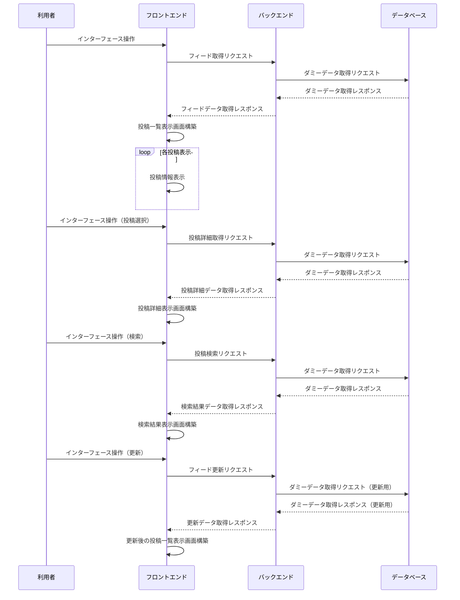

# ykawa

 
  
  

```mermaid
sequenceDiagram
  participant User as 利用者
  participant Frontend as フロントエンド
  participant Backend as バックエンド
  participant Database as データベース

  User->>Frontend: インターフェース操作
  Frontend->>Backend: フィード取得リクエスト
  Backend->>Database: ダミーデータ取得リクエスト
  Database-->>Backend: ダミーデータ取得レスポンス
  Backend-->>Frontend: フィードデータ取得レスポンス
  Frontend->>Frontend: 投稿一覧表示画面構築

  loop 各投稿表示
    Frontend->>Frontend: 投稿情報表示
  end

  User->>Frontend: インターフェース操作（投稿選択）
  Frontend->>Backend: 投稿詳細取得リクエスト
  Backend->>Database: ダミーデータ取得リクエスト
  Database-->>Backend: ダミーデータ取得レスポンス
  Backend-->>Frontend: 投稿詳細データ取得レスポンス
  Frontend->>Frontend: 投稿詳細表示画面構築

  User->>Frontend: インターフェース操作（検索）
  Frontend->>Backend: 投稿検索リクエスト
  Backend->>Database: ダミーデータ取得リクエスト
  Database-->>Backend: ダミーデータ取得レスポンス
  Backend-->>Frontend: 検索結果データ取得レスポンス
  Frontend->>Frontend: 検索結果表示画面構築

  User->>Frontend: インターフェース操作（更新）
  Frontend->>Backend: フィード更新リクエスト
  Backend->>Database: ダミーデータ取得リクエスト（更新用）
  Database-->>Backend: ダミーデータ取得レスポンス（更新用）
  Backend-->>Frontend: 更新データ取得レスポンス
  Frontend->>Frontend: 更新後の投稿一覧表示画面構築
```
